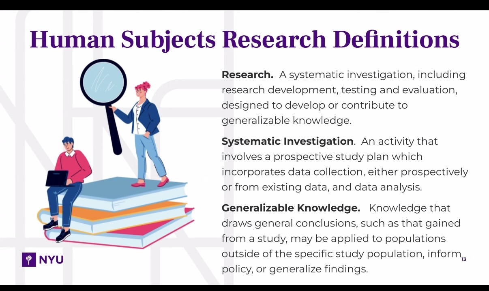
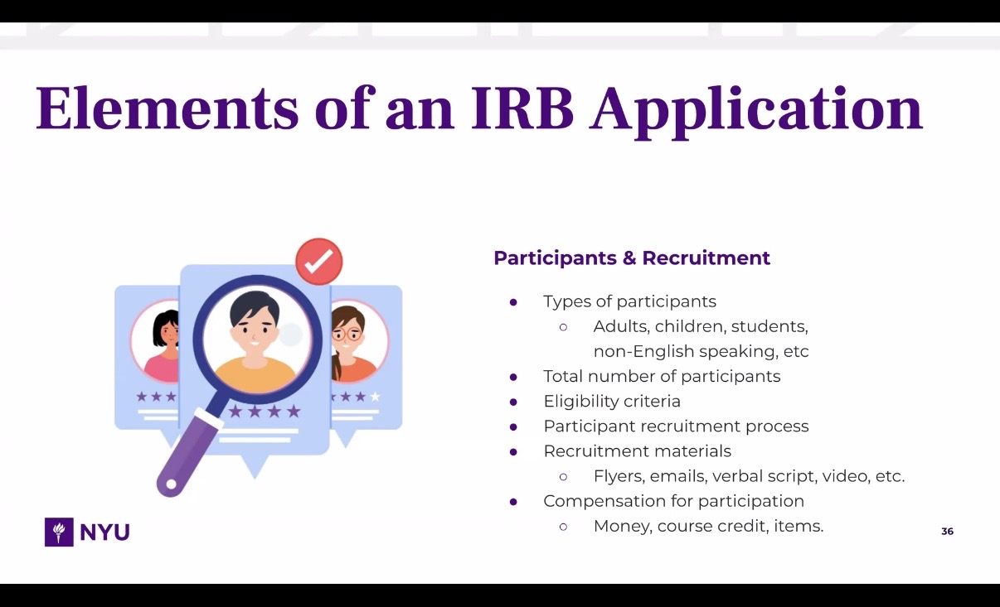
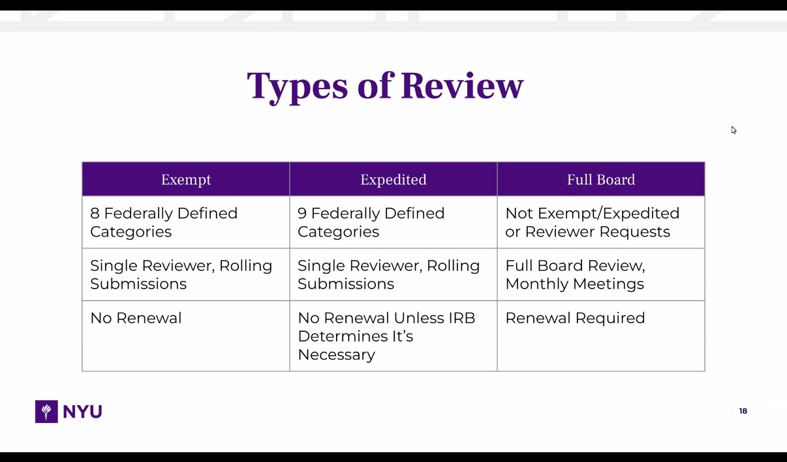

### Details on the event
* Time / Date: 7:00 – 8:30pm (Abu Dhabi Timezone), February 13, 2026
* Location: Zoom (New York Campus session)

### Main Points and Ideas
The presentors were professionals from the *Research Integrity and Compliance and Data Services* team. They talked about the NYU Institutional Review Board (IRB), which I had never heard of before. However, it was still very interesting because they explained a lot about the ethical aspects of human research. I am much more familiar with research that doesn't involve humans (mostly experimental research which involves a lot more math and as suggested by its name, experiments). It was truly eye-opening to see how much more complicated it is when human ethics are involved.
They also introduced REDCap, a survey and data collection tool, which is suppose to give us guidance when it comes to maintaining research ethics and using data responsibly.
#### Links from the Meeting
* [Research with Human Subjects](https://www.nyu.edu/research/resources-and-support-offices/getting-started-withyourresearch/human-subjects-research.html) -- this is the NYU (New York) page for general information for researches involving humans. This website explains what the steps are to properly conduct research (apparently there are forms to filled out and training to be completed). There is also an overwhelming amount of guidance material but I'm sure it will be very helpful for those who need it :P
* [Human Research Protection Program](https://nyuad.nyu.edu/en/research/facilities-and-support/human-research-protection-program.html) -- This *Human Research Protection Program* is NYU Abu Dhabi specific. Similar to the New York's website, there are also application instructions and guides for researchers to follow. The website contains information about the *Research Ethics Committee (REC)* which is for Abu Dhabi based biomedical research (involving human tissue sampling) (Abu Dhabi specific because it follows *Abu Dhabi Department of Health*'s policy).
* [REDCap](https://project-redcap.org/) -- a web application for building and managing online surveys and databases. NYU recommeneded this application to conduct questionnaires and forms for research purposes.
#### Screenshots of the Meeting
Unfortunately, I wasn't able to directly attach the screenshots on here. Please see this Google Drive folder: [LoveDataWeekMeeting](https://drive.google.com/drive/folders/1AvTpsjyl3NoSEcjVeGayVBprnWqwuoZf?usp=sharing) for my screenshots.
<!-- 

 -->
### Reflection
I personally do not see myself having to conduct these type of researches in the future (we will see hehe) although being a researcher is really cool and I would love to carry out my own human-involved research one day. That said, I still find this meeting to be a very valuable session as it gives me a much much better idea of research in humanities. It is basically eye-opening. I did not know too much about human research and definitely did not expect it to be so complicated. Part of the reason why it's so interesting is because it involves ethics. This is much more absent in experimental research (which I am more familiar with).
In terms of connection with our course, I think that it reshapes my understanding of humanities overall. While 'humanities' can seem intuitively at times, that definitely is not the case with research. Gathering data, collecting data, manipulating data, is already a difficult task by itself. But since it is not just any data, it's HUMAN data, sometimes the stakes are higher and the process is more complicated.
Also, I did not know college-level research could be so serious. I can imagine capstone projects involving serious researches like this, where students have to go through a whole process of application (and wait for approval to conduct research), then carry out the research itself, treating research data correctly, and interpret it correctly as well. For other undergraduate research projects, if people have to do this, then I would be even more impressed (I am already so impressed after learning how human research works).
Overall, my biggest takeaway isn't immediate knowledge I can apply, but the session has left me in a mini 'awe!' I actually learned a lot from this session and this new understanding of humanities is my favorite takeaway. Regarding the tools and links that the presentation provided, I will definitely keep a copy of it, because who knows, I might need it one day :D

**READY FOR GRADING**