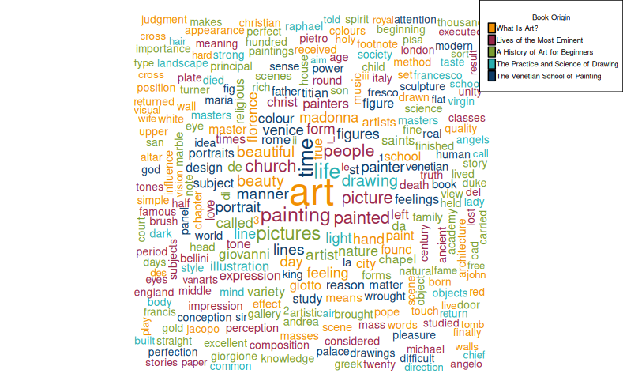
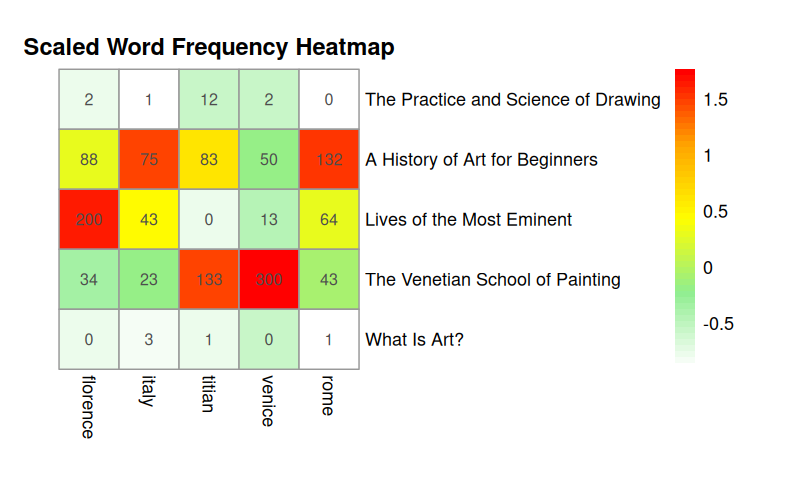

## Corpus Selection

For my corpus, I have decided to explore the [Art collection](https://gutenberg.org/ebooks/bookshelf/675) in [Project Gutenberg](https://gutenberg.org/). I chose to work with this topic because not only do I have a personal interest in art, but I was also curious to see what kind of information do books in public databases have about something that relies heavily on visuals as art (I don't often read art books, I usually prefer seeing them in person in galleries and museums). It will be especially cool if I learn something I had not known before (since placards at musuems only offer very little insights about the artworks themselves and the artists).
The texts I've chosen are:
* What Is Art? by graf Leo Tolstoy (64908)
* Lives of the Most Eminent Painters Sculptors and Architects, Vol. 01 (of 10) (25326)
* A History of Art for Beginners and Students: Painting, Sculpture, Architecture (24726)
* The Practice and Science of Drawing by Harold Speed (14264)
* The Venetian School of Painting by Evelyn March Phillipps (30098)

### Process & Rationale
When I was curating this corpus, I tried to choose texts that were similar in length. This is because if a text is significantly longer/shorter than the others, it will be over/underrepresented which skews the data. In the end, the five chosen texts are similar in length, with the longest text having 92349 words compared to the shortest text with 80030 words.
Although these books are all about Art, I wanted to choose books that were written around the same time to minimize the extraneous variables that might impact data. Most of the books in the corpus were written from mid-19th century to the early 20th century, with the exception of the book coded 25326 (written in the 1500s). While I understand that it can be an "outlier" or so, I decided to include it in the corpus to see if there are any visible differences when conducting distant reading.

I hypothesis that there will be a mix of 'art history' content and 'the practice of art' content. What I really mean by this is, some books will perhaps focus more on the historical contexts and the painters, such as books 25326 and 30098. Meanwhile, books like 64908 and 14264 are more likely to cover the technical aspect of art (for example: how to draw and paint, the building blocks of a painting, etc.). When I was researching these texts, I also noticed that most of these texts had something to do with Europe (whether that is about European art, or written by European authors, or both!). This naturally makes sense because given the context these books were written, art was mostly flourishing in Europe.

## Analysis
My corpus selection covers a wide-range of topics in Art, so it was definitely going to be interesting conducting distant reading. As instructed, I used Voyant Tools and RMarkdown on Posit Cloud, both of which are tools we have used in class, to do the distant reading. As I was playing around with the tools, I've taken notes of interesting details below.
### Visualizations
Description of RMarkdown & Voyant Tools and how I used them.
#### RMarkdown
I really enjoy the **color-coded word cloud** feature in RMarkdown. It allows me to see which group of words belongs to which text, which gives me a better idea of which aspect of art they are talking about. They also help me confirm (or reject) my initial hypothesis about the content of these books. However, a potential set back might be that this word cloud does not distinguish words that appear in 2 or more books, which can potentially mislead my interpretation of the corpus.

*My color-coded word cloud for my corpus (5 texts)*

What I learned in this process too, is to play around with the code! I was experiencing issues with the legend being too big and covering almost all of the word cloud, but then I did a bit of research and learned some parameters I could add to shrink the legend.

This is the **Scaled Frequency Heat Map**. The words I've chosen are all Italian-related. I was curious to see how often (or not) Italy was mentioned in the corpus. Before my actually running the code, I hypothesized that the book *The Venetian School of Painting by Evelyn March Phillipps (30098)* will allude to Italy the most, for obvious reasons. Initally, I was worry that this specific text would skew the dataset because of the specificity of the geographical location, but the results of the frequency heat map completely surprised me!

The words I've chosen are: Rome, Florence, Venice (primary Italian cities associated with artistic developments (partially due to the Silk Road trading)), Titian (a very famous Italian painter), and Italy. The photo below shows the map.

*My Scaled Frequency Heat Map for Italy-related terms*

I did not expect to see Italy being referenced in books other than *30098*. However, what surprised me even more is that Rome, Florence, and Venice appeared a lot, but in 3 completely different books.  Meanwhile, there is a correlation between the mention of Venice and Titian in book *30098*, which led me to **suspect that Titian is from Venice. A Google search confirms that Titian was born in a different Italian city, but lived and worked in Venice for the vast majority of his life**. This was a detail I did not know before!

#### Voyant Tools
Something that Voyant Tools allows me to do (easily) is to add additional stopwords. My texts are all from Project Gutenberg, so I wanted to remove any irrelevant watermarks out of the dataset (which becomes more clear when they appear on wordclouds). Specificaly, the words I have added to the default stopword list on Voyant Tools are: Project; Gutenberg; sec; footnote; eBook; chapter

* Trend Graph
* Berry
* Word cloud iFrame
<iframe style='width: 100%; height: 800px;' src='https://voyant-tools.org/?view=Cirrus&stopList=keywords-5ffb051b33a7904b7bdc3962d116a70c&corpus=5b0f5687b3374202f5ab53af19474e4d'></iframe>

## Reflection

